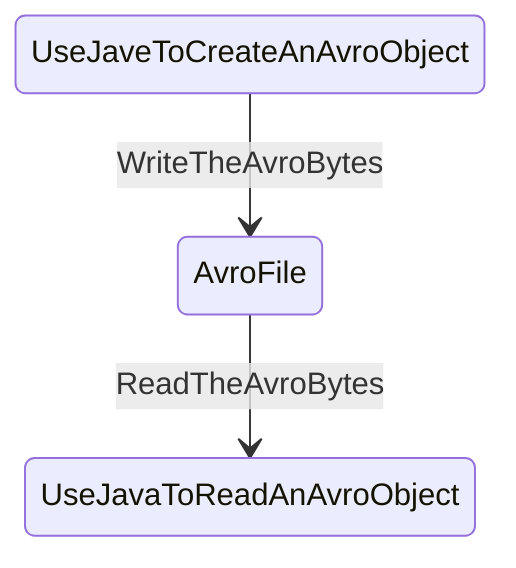
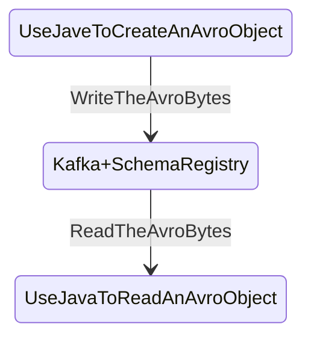

## What we currently have achieved ? 

```mermaid
stateDiagram
    UseJaveToCreateAnAvroObject-->AvroFile:WriteTheAvroBytes
    AvroFile-->UseJavaToReadAnAvroObject:ReadTheAvroBytes
```

## What we will achieve later ? 

```mermaid
stateDiagram
    UseJaveToCreateAnAvroObject-->Kafka+SchemaRegistry:WriteTheAvroBytes
    Kafka+SchemaRegistry-->UseJavaToReadAnAvroObject:ReadTheAvroBytes
```